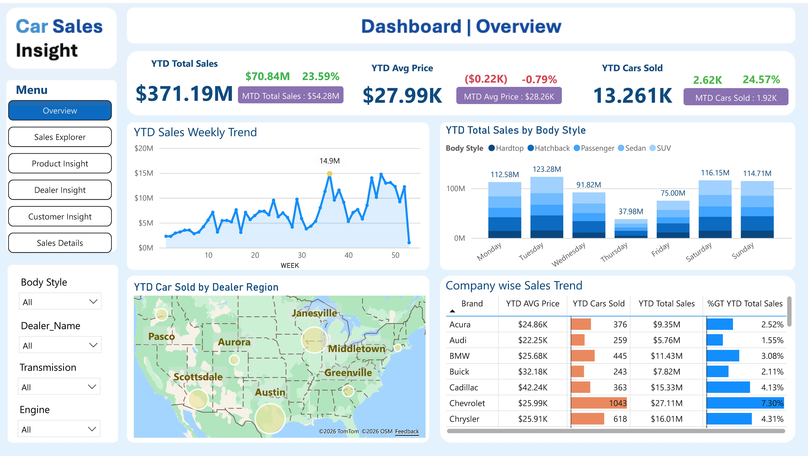
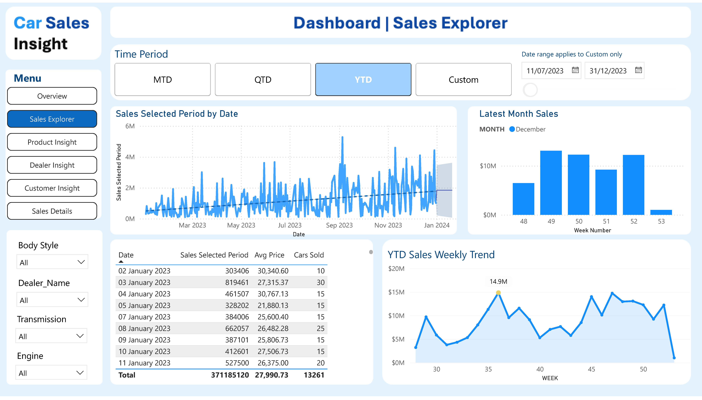
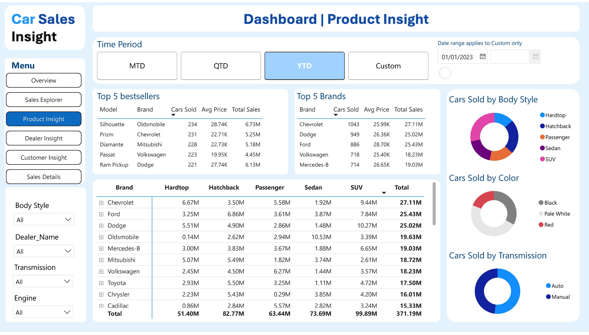
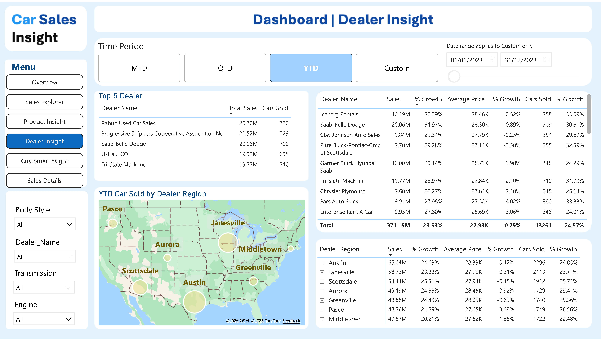
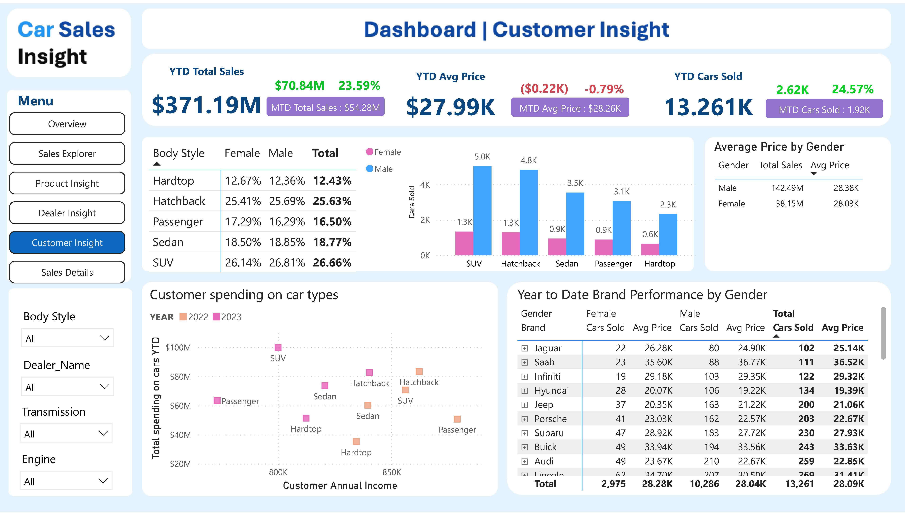
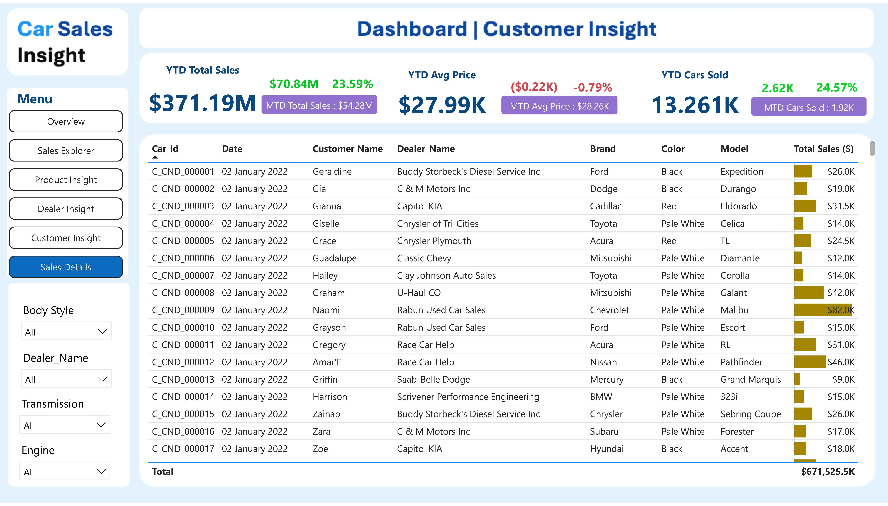

# 📊 Car Sales Dashboard (Power BI)

## 📌 Dashboard Overview

This project presents a comprehensive **Power BI dashboard** analysing car sales performance across multiple dimensions, including product, dealer, customer, and transaction-level data.

The dashboard is structured into multiple analytical pages, each focusing on a specific business perspective.

---

## 🎯 Business Objective

To provide a **centralised analytical solution** that enables stakeholders to:

- Monitor sales performance  
- Identify key revenue drivers  
- Analyse dealer and regional performance  
- Understand customer behaviour  
- Support data-driven decision-making  

---

## 📄 Full Dashboard

👉 [View Full Dashboard (PDF)](./CarSalesDashboard.pdf)  
(:contentReference[oaicite:0]{index=0})

---

# 📊 Dashboard Pages Breakdown

---

## 1️⃣ Overview Page

The Overview page provides a **high-level summary of business performance**.

### Key Features:
- YTD Total Sales: **$371.19M**
- Sales Growth: **+23.59%**
- Cars Sold: **13.26K**
- Average Price: **$27.99K**

### Insights:
- Strong overall growth indicates positive business performance  
- Weekly trends reveal fluctuations suggesting potential seasonality  
- SUVs and Hatchbacks dominate total sales contribution  
- Regional map highlights geographical performance distribution  

---

## 2️⃣ Sales Explorer Page

This page focuses on **time-based analysis and trend exploration**.

### Key Features:
- Time filters (MTD, QTD, YTD, Custom)  
- Daily sales tracking  
- Weekly trend analysis  
- Latest month performance  

### Insights:
- Sales show variability over time, indicating possible seasonal patterns  
- Increasing trend over the year suggests growing demand  
- Time-based filtering enables flexible analysis for business users  

---

## 3️⃣ Product Insight Page

This page analyses **product performance across brands and categories**.

### Key Features:
- Top 5 best-selling models  
- Top-performing brands  
- Sales breakdown by body style  
- Sales distribution by colour and transmission  

### Insights:
- SUVs and Hatchbacks are the key revenue drivers  
- Certain brands significantly outperform others  
- Product mix plays a critical role in revenue generation  

---

## 4️⃣ Dealer Insight Page

This page focuses on **dealer and regional performance analysis**.

### Key Features:
- Top-performing dealers  
- Dealer sales growth comparison  
- Regional sales distribution  
- KPI comparison across dealers  

### Insights:
- Significant variation exists between dealer performance  
- High-performing dealers can serve as benchmarks  
- Regional differences highlight operational opportunities  

---

## 5️⃣ Customer Insight Page

This page explores **customer behaviour and segmentation**.

### Key Features:
- Sales by gender  
- Car preferences by body style  
- Customer income vs spending analysis  
- Brand performance by customer segment  

### Insights:
- Different customer groups show distinct purchasing behaviours  
- SUVs are consistently popular across segments  
- Income level influences spending patterns  

---

## 6️⃣ Sales Details Page

This page provides **transaction-level data for detailed analysis**.

### Key Features:
- Individual sales records  
- Customer, dealer, and product details  
- Drill-down capability for deeper investigation  

### Insights:
- Enables validation of aggregated insights  
- Supports operational and auditing analysis  
- Provides full transparency of underlying data  

---

# 📈 Key Business Insights

- Strong YTD growth (**+23.59%**) indicates robust market performance  
- Revenue is concentrated in specific product categories (SUV, Hatchback)  
- Dealer performance varies significantly across regions  
- Slight decrease in average price suggests volume-driven growth strategy  

---

# 💡 Business Recommendations

- Focus on high-performing product categories  
- Improve underperforming dealer regions  
- Optimise pricing strategy to balance margin and volume  
- Align promotions with seasonal demand patterns  

---

# 🛠 Tools & Technologies

- Power BI  
- DAX  
- Data Modelling  

---

# 📁 Project Structure
